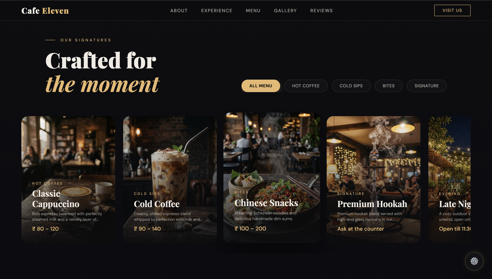
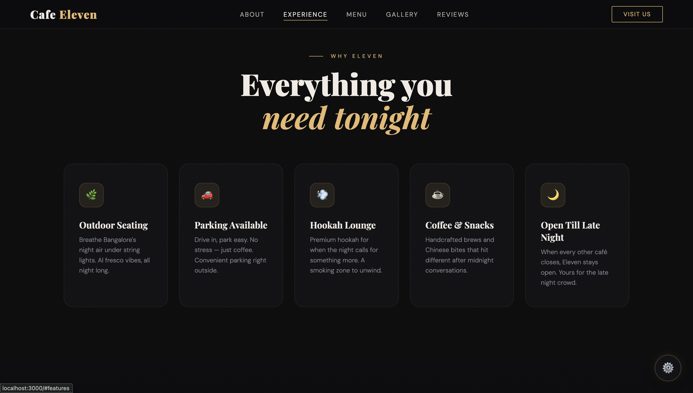
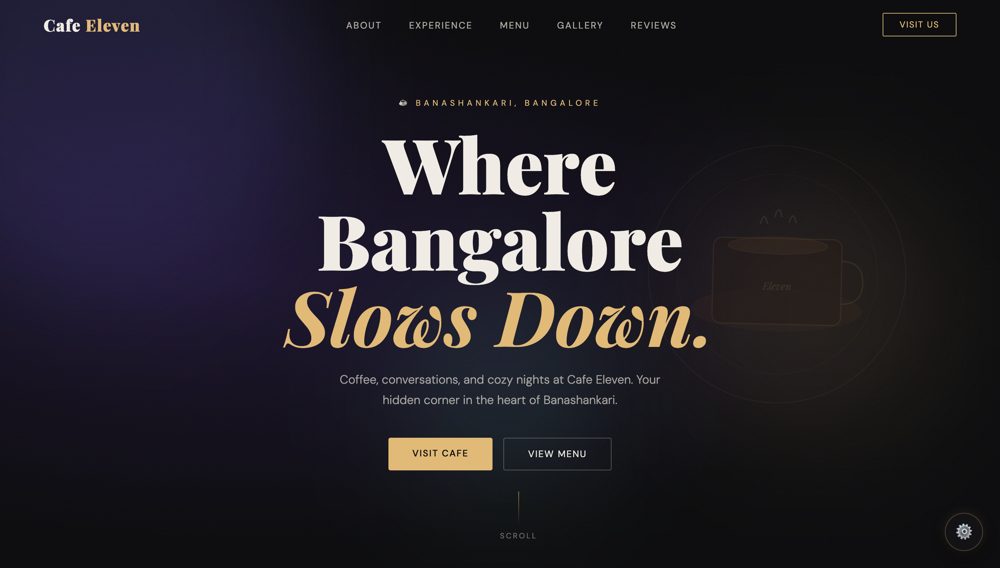
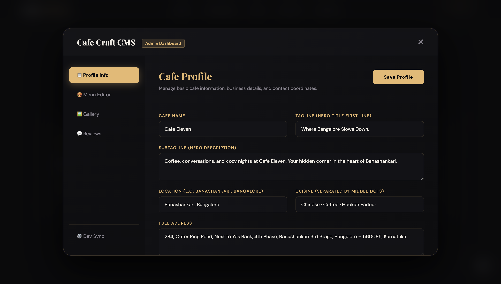

# ☕ Cafe Eleven — Premium Cafe Experience Website

An immersive, cinematic, and luxury-inspired café website built for **Cafe Eleven, Banashankari, Bangalore**.

Designed with:
- Modern UI/UX
- Smooth animations
- Dark luxury aesthetics
- Premium café storytelling
- Interactive CMS dashboard

---

# 🌙 Live Experience

A digital experience inspired by:
- Bangalore nightlife culture
- Cozy coffee conversations
- Late-night café ambience
- Gen Z aesthetics
- Editorial luxury design

---

# ✨ Features

- Cinematic Hero Section
- Smooth Scroll Animations
- Interactive Experience Cards
- Signature Menu Showcase
- Bento Gallery Layout
- Animated Reviews Section
- Premium Dark Theme
- Fully Responsive Design
- Custom Admin CMS Dashboard

---

# 🛠 Tech Stack

- **Next.js**
- **React**
- **Tailwind CSS**
- **Framer Motion**
- **GSAP**
- **Lenis Smooth Scroll**
- **Glassmorphism UI**
- **Responsive Layouts**

---

# 🎨 Design System

## Theme
Luxury dark café aesthetic inspired by premium editorial websites and Awwwards experiences.

## Color Palette
- Espresso Black
- Warm Gold
- Coffee Brown
- Cream Beige

## UI Style
- Frosted Glass Cards
- Cinematic Gradients
- Smooth Hover Effects
- Premium Shadows
- Noise Textures
- Floating Ambient Elements

---

# 📸 Project Preview

---

## 🌙 Signature Menu Experience

Premium cinematic menu section with editorial typography and luxury café visuals.



---

## ✨ Experience Highlights

Interactive feature cards showcasing:
- Outdoor Seating
- Parking Available
- Hookah Lounge
- Coffee & Snacks
- Open Till Late Night



---

## ⚙ Premium Admin CMS Dashboard

Custom-built CMS dashboard for managing:
- Café profile
- Menu
- Gallery
- Reviews



---

## 🛠 Cafe Profile Management

Editable business information panel with luxury dashboard UI.



---

# 📄 Website Sections

---

## 🏠 Hero Section

A fullscreen cinematic landing experience with:
- Luxury typography
- Animated CTAs
- Ambient gradients
- Smooth transitions
- Premium navigation

---

## ✨ Experience Section

Highlights the emotional identity of Cafe Eleven through immersive feature cards.

### Includes
- Outdoor seating
- Hookah lounge
- Late-night vibe
- Coffee & snacks
- Parking availability

---

## ☕ Signature Menu Section

A cinematic showcase for:
- Cappuccino
- Cold Coffee
- Chinese Snacks
- Premium Hookah
- Evening Specials

Features:
- Hover animations
- Rich image overlays
- Category filters
- Luxury card layouts

---

## 🖼 Gallery Section

Editorial-style masonry gallery featuring:
- Warm lighting
- Cozy interiors
- Outdoor ambience
- Bangalore café culture

---

## ⭐ Reviews Section

Premium animated review cards inspired by real customer feedback.

Includes:
- Floating testimonials
- Smooth transitions
- Elegant typography

---

# ⚙ Admin CMS Dashboard

A fully customizable dashboard to manage website content.

---

## 📋 Profile Info
Manage:
- Café name
- Hero tagline
- Description
- Location
- Cuisine
- Address

---

## 🍔 Menu Editor
Update:
- Menu items
- Categories
- Prices
- Descriptions

---

## 🖼 Gallery Manager
Manage:
- Café images
- Featured visuals
- Gallery sections

---

## 💬 Reviews Manager
Edit:
- Customer testimonials
- Ratings
- Review content

---

# 📸 Adding Images

All website images are stored inside the `/public/images` folder.

---

## 📂 Folder Structure

```bash
public/
 └── images/
      ├── hero.jpg
      ├── cappuccino.jpg
      ├── cold-coffee.jpg
      ├── hookah-night.jpg
      ├── outdoor-seating.jpg
      ├── gallery-1.jpg
      └── gallery-2.jpg
```

---

## 🖼 Using Images in Components

```jsx
import Image from "next/image";

<Image
  src="/images/cappuccino.jpg"
  alt="Cappuccino"
  width={600}
  height={800}
  className="rounded-3xl object-cover"
/>
```

---

## 🌌 Hero Background Example

```jsx
<div
  className="h-screen bg-cover bg-center"
  style={{
    backgroundImage: "url('/images/hero.jpg')",
  }}
>
```

---

# 📱 Mobile Experience

Fully optimized for:
- Mobile devices
- Tablets
- Large screens

The mobile experience is designed to feel like a luxury lifestyle application.

---

# 🚀 Performance Features

- Optimized animations
- Responsive layouts
- Smooth scrolling
- Reusable components
- Fast loading experience

---

# 📂 Project Structure

```bash
/components
/sections
/data
/public
/screenshots
/styles
/app
```

---

# ⚡ Installation

```bash
npm install
```

---

# ▶ Run Development Server

```bash
npm run dev
```

Open:

```bash
http://localhost:3000
```

---

# 📍 Cafe Information

### Cafe Eleven
Banashankari 3rd Stage, Bangalore

Open till late night 🌙

---

# 🔥 Future Improvements

- Online reservations
- Ordering system
- Instagram integration
- Dynamic backend CMS
- Loyalty rewards
- AI recommendations

---

# 👨‍💻 Developed For

Cafe Eleven — Bangalore Café Experience Project

Designed to elevate the café’s digital identity through cinematic storytelling and immersive UI.

---

# 🌌 Final Note

> “Not just coffee. A feeling.”